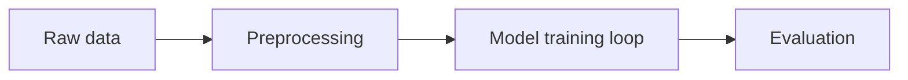

# Actuarial ML Paper Brief

Use this when asked to summarize a machine-learning or AI research paper for an actuary. 

**Your reader:**
- Technically strong and knows machine learning well
- Not necessarily an expert in this specific method
- Not necessarily an expert in the applied field (health claims, telematics, cyber, catastrophe modelling, or anything else)

**Core principle:** Do not just read the paper and paraphrase it. Build a narrative that starts from something the reader already knows, then bridges across to the new method.

---

## Before writing

### Read the full text of the paper, not just the abstract
If a number, a name, or a detail isn't actually stated in the paper, don't present it as fact. If you infer something rather than find it stated, say so clearly in the text itself, for example: "Inference flag: the paper doesn't say this, but..."

### Pick the right starting point

Open from a familiar modelling baseline:

- **Default:** Generalized Linear Model (GLM) — the standard tool for pricing and claims-frequency modelling, since it's the most common shared reference point for actuaries
- **If more natural:** Compare to tree-based models like GBM, chain-ladder reserving methods, or credibility theory instead
- **Selection rule:** Pick whichever familiar method makes the new one easiest to understand by contrast
- **Important:** Treat this baseline as a stand-in for "a familiar structured model," not a literal claim that GLMs are the only relevant comparison

---

## Structure, section by section

Walk through the paper's major sections in order. For each one, cover:

1. **What problem this section solves** — in a sentence or two, plainly
2. **What any tables or numbers actually mean** — in words a non-specialist would follow
3. **Why it matters in a real production setting** — not just as research
4. **The trade-off or cost of this particular design choice**
5. **A likely failure mode or edge case**
6. **One sharp, specific question a careful reader should ask** — briefly answered

### Use worked examples

Include a small worked numerical example wherever it helps make an idea concrete. If you build a numerical example that isn't from the paper itself, say so plainly, right where you use it.

### Use comparison tables

Where two competing approaches are being compared (e.g., this paper's method versus an alternative like embeddings plus a downstream classifier, or prompting versus fine-tuning), use a short comparison table instead of a paragraph.

### Explain validation claims

Whenever a paper says something was "validated," "checked," or "tested," explain plainly what that actually involved:
- How many examples?
- Who did the checking?
- What was it compared against?

Never leave a claim like that unexplained. A vague verb like "checked" is not an explanation.

---

## Process flow diagram (mandatory, persisted as PNG)

**Every brief must include this diagram, regardless of what the request
wording asks for.** It is a fixed part of this skill's output, not an
optional extra to include only if the user mentions "diagram" or
"process flow." A diagram that only exists in your response text is an
incomplete task - it must be written to disk as an image, not left to
float in the chat.

Include a Mermaid flowchart of the paper's own method — the process the
authors used to get from raw input to their reported results. **No more
than 6 boxes.** Cover, wherever the paper describes them:

- Data source / data transformation steps (cleaning, feature engineering)
- Any loop or iterative step (training loop, cross-validation, resampling)
- Model fitting step
- Output / evaluation step

Collapse minor sub-steps into their nearest box to stay within 6 - this
is meant to orient the reader, not reproduce the paper's full pipeline.
If a step is inferred rather than stated, mark it as such in the text
around the diagram, consistent with the inference-flagging rule above.

Then persist it:
1. Build a short slug from the paper's title or filename (e.g. `attention-is-all-you-need`)
2. Write the Mermaid source to `<slug>_process_diagram_<timestamp>.mmd` in the current working directory (no project-specific output folder applies to this skill - if the user has a preferred location, use that instead)
3. Render it: `mmdc -i <slug>_process_diagram_<timestamp>.mmd -o <slug>_process_diagram_<timestamp>.png -b white`
4. If `mmdc` isn't installed or the render fails (e.g. no headless browser available in this environment), don't block on it - the `.mmd` file from step 2 is the fallback home. State clearly in your response which one happened.
5. Confirm the PNG (or, on fallback, the `.mmd`) exists before finishing, and state its path in the brief - e.g. `ls` it.
6. Surface the PNG inline in the conversation itself (not just on disk) - display the rendered image as part of your response, in addition to persisting the file. Both must happen; neither replaces the other.

---

## Language rules (this is the part that matters most)

### Write in plain, short sentences
One idea per sentence where possible.

### Define every abbreviation and piece of jargon
Define them the first time you use them, in a plain phrase, not just a technical parenthetical. Assume the reader has not read the paper and does not work in its applied field.

### Do not write to sound clever
Avoid stacking several clauses into one sentence with dashes, semicolons, or nested parentheticals. If a sentence needs to be read twice to be understood, split it into two.

### Avoid dense listing sentences
Do not cram three ideas together with semicolons. Prefer short separate sentences, or a bulleted list.

---

## Ending

Close with:

1. **Five-sentence recap** of the whole paper
2. **Short list of concepts** the reader should now be able to explain to someone else, in their own words

**Before returning the brief, confirm the process flow diagram PNG (or
`.mmd` fallback) from the "Process flow diagram" section above actually
exists on disk** — e.g. `ls` it. If it's missing, produce it before
finishing — do not submit the brief without it.

---

## Length

Aim for a rough word-count target if one is given, but treat it as a target, not a hard limit. If covering every required element (definitions, trade-offs, failure modes, worked examples) pushes the piece longer, let it run longer, and say so, rather than cutting required content just to hit a number.
