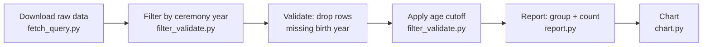

# Oscar Award Winners by Director Age

Finds Academy Award-winning films where the film's **director** was born
before a given cutoff year (default: 1955). Every award category counts
(Best Picture, Best Director, Best Sound Editing, Documentary Short,
etc.) - the age check always uses the director's birth year, regardless
of which specific award the film or person won.

## Data source and its limits

Data comes from Wikidata (the structured database behind Wikipedia's
infoboxes), via public SPARQL queries - not an official Academy source.
It's crowd-sourced: birth years and director credits can be missing or
wrong for lesser-known films, especially older ones and short-subject
categories. Treat results as a starting point, not ground truth - spot-check
anything surprising against a primary source (e.g. the Academy's own
awards database) before using it in course material or anywhere that
needs to be authoritative.

## Dependencies and library installation

Stages 1–3 use only Python standard library. Stage 4 (`chart.py`) requires:
- `Pillow` (PIL) - image generation
- `matplotlib` - charting

If any library import fails during stage execution, install it using one of:
- **If `pip` is available:** `pip install <library-name>`
- **If `pip` is unavailable, use `uv`:** `uv pip install <library-name>`
- **Or run with venv activated:** `source .venv/bin/activate && python3 <stage>.py`

Example (if stage 4 fails with `ModuleNotFoundError: No module named 'PIL'`):
```bash
uv pip install Pillow matplotlib
source /path/to/.venv/bin/activate
python3 chart.py
```

## Pipeline

Run the four scripts **in this directory, in order**. Each stage writes
its output to a new, timestamped file that the next stage reads, so a
failed or incorrect later stage doesn't force re-running the expensive
Wikidata query.

**File naming**: every output file is stamped with the run's local
London time (Europe/London - auto BST/GMT) in its name, e.g.
`oscar_raw_20260813T211700.tsv`. Nothing is ever
silently overwritten, so the folder keeps a full history of every run
and it's always obvious whether a given file is fresh or stale. Each
stage automatically reads the *most recent* file matching its expected
input pattern (plain filename-sort, since the timestamp format sorts
correctly as text) and prints which file it picked up - check that
printed line if you're ever unsure which run's data you're looking at.

1. `python fetch_query.py`
   Wide, unfiltered pull from Wikidata: every Academy Award category,
   full history (1929-present), no birth-year or ceremony-year
   filtering. Missing director or birth-year data is left blank rather
   than dropping the row. Writes `oscar_raw_<timestamp>.tsv`. This is
   the slow step (single SPARQL query, but a large one) - only re-run
   it if you need fresher or wider data, not when just changing the
   cutoff or year floor.

2. `python filter_validate.py`
   Reads the latest `oscar_raw_*.tsv`. Applies the ceremony-year floor
   (`Ceremony Year >= YEAR_FLOOR`) first, then reports how many of the
   remaining rows are missing a director or birth year, drops rows that
   can't be checked (no birth year), then applies the age cutoff
   (`director_birth_year < CUTOFF_YEAR`).
   **To change the cutoff or year floor**, edit `CUTOFF_YEAR` or
   `YEAR_FLOOR` at the top of this file and re-run - no need to
   re-fetch. Writes `oscar_filtered_<timestamp>.tsv`.

3. `python report.py`
   Reads the latest `oscar_filtered_*.tsv`, groups by film + ceremony
   year, counts awards won per film, prints a summary table.
   Writes `oscar_report_<timestamp>.tsv` - the tabular deliverable.

4. `python chart.py`
   Reads the latest `oscar_report_*.tsv`, plots award wins and count of
   distinct qualifying directors per ceremony year as a line chart.
   Writes `oscar_wins_by_year_<timestamp>.jpg` - the visual deliverable.

## Process diagram (for non-coders)

Before the reviewer runs, produce a plain-language Mermaid flowchart of
the pipeline actually run - **no more than 6 boxes** - so someone who
doesn't code can follow what happened without reading the scripts:



Adjust the labels if the actual run skipped a stage (e.g. re-used a
cached raw file and only re-ran stages 2-4).

## When asked a new/different question about Oscar winners

If the request changes the cutoff year or ceremony-year floor only,
edit `CUTOFF_YEAR` and/or `YEAR_FLOOR` in `filter_validate.py` and
re-run stages 2, 3, and 4 (skip stage 1 - the raw data doesn't change).
If the request needs different data entirely (e.g. a different award, a
different attribute to filter on), stage 1's SPARQL query will need
editing, since it currently only captures award, film, director, and
director birth year.
