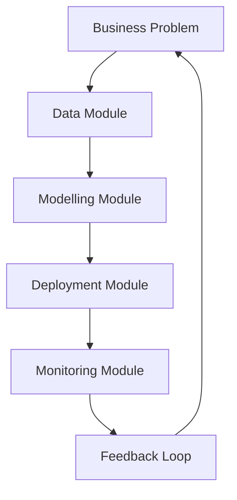

<!-- batch_metadata: {"prompt_hash": "1e623dd6", "batch_timestamp": "20260816_160943"} -->

### Summary for an Actuary Reader

This paper presents a **modular framework for building and managing machine learning (ML) pipelines in insurance**, especially relevant to actuaries who are already familiar with traditional modeling tools like Generalized Linear Models (GLMs), credibility theory, or GBM-based reserving. The author, John Ng—a senior data scientist at RGA and actuary—frames ML not as a replacement for classical methods, but as a **structured operational system** that can enhance pricing, risk modeling, fraud detection, and customer analytics.

We'll build the narrative from what you know: **a GLM or GBM is used to model claims frequency or severity**, with assumptions about linearity, additivity, and distributional form. But real-world data often violates these assumptions—non-linear relationships, high-dimensional interactions, unstructured inputs (like text or wearables), and imbalanced outcomes (e.g., rare fraud). That’s where this pipeline approach becomes useful.

---

### 1. Introduction & Context  
**Problem solved**: Actuaries face increasing pressure to improve predictive accuracy and adapt to new data types (e.g., NLP, wearables), while maintaining auditability, scalability, and business alignment. Traditional modeling workflows struggle here.

**Why it matters**: In production, models need to be updated regularly, monitored, deployed safely, and explainable. A modular pipeline ensures consistency across teams and projects.

**Trade-off**: Increased complexity vs. better performance and maintainability. You trade manual coding for structured automation.

**Failure mode**: A well-trained model can fail silently if monitoring isn’t set up properly—e.g., drifting data causes poor predictions over time.

**Sharp question**: *How do we ensure that a complex ML pipeline doesn't become a black box that loses interpretability without good governance?*

> ✅ **Narrative bridge**: Think of your standard GLM or GBM workflow as a single step in a larger process. This paper shows how to turn that into a repeatable, scalable, and auditable system.

---

### 2. Business Problem Definition  
**Problem solved**: Clearly define the goal—e.g., reduce fraud losses, optimize premiums, predict CLV. Without clear objectives, any model will lack impact.

**What tables/numbers mean**: The slide mentions $40B/year in US non-health fraud. That’s **not just a number—it represents cost of inefficiency**. It quantifies why automated systems matter.

**Why it matters**: If you don’t tie modeling to business metrics (e.g., “save $X per claim”), you’re optimizing the wrong thing.

**Trade-off**: Too much focus on business goals can lead to narrow models; too little leads to technical noise.

**Failure mode**: Modeling "fraud" without defining financial impact may misprioritize false positives.

**Sharp question**: *How do we quantify economic value when the outcome is binary (fraud/no fraud)?*  
→ Answer: Use a **value function**—sum of saved claim amounts minus investigation costs.

---

### 3. Data Module  
**Problem solved**: Raw data is messy. You need clean, transformed features ready for modeling.

**What tables/numbers mean**:  
- Feature engineering includes transformations (log, power), interactions, binning, etc.
- Imputation methods: Mean/Median vs. MICE/KNN.
- Splitting into train/validation/test sets prevents overfitting.

**Why it matters**: Bad data → bad models. EDA helps detect outliers, missingness, skewness. Stratified sampling preserves class balance (important for fraud).

**Trade-off**: Manual feature engineering takes time and domain knowledge; automated methods risk missing key insights.

**Failure mode**: Using post-event information (e.g., claim amount before policy start) creates leakage.

**Sharp question**: *When should I use automatic vs. expert-driven feature engineering?*  
→ Answer: Start with domain knowledge (expert-driven), then test automated methods (e.g., RF-based interaction detection) for gains.

> 🔁 **Worked example**: Suppose you're modeling auto claims. You have age, gender, vehicle type, and prior claims.  
> - Log-transforming claim amount reduces skew.  
> - Create interaction: `age × prior_claims` to capture young drivers with history.  
> - One-hot encode vehicle type.  
> - Replace missing values using KNN based on similar policies.

---

### 4. Modelling Module  
**Problem solved**: Choose algorithms, tune hyperparameters, evaluate performance.

**What tables/numbers mean**:  
- Algorithms listed: Random Forest, XGBoost, GLM, SVM, Neural Nets.
- No free lunch theorem: no single algorithm works best everywhere.

**Why it matters**: In pricing, you might compare a GLM to XGBoost. Even if XGBoost scores higher on AUC, does it make sense? Is it interpretable?

**Trade-off**: Complex models (e.g., deep nets) offer higher accuracy but less transparency. Simpler models are easier to validate.

**Failure mode**: Overfitting due to poor validation strategy (e.g., no holdout set).

**Sharp question**: *If I use XGBoost, how do I assess variable importance and check for bias?*  
→ Answer: Use SHAP values or permutation importance.

| Approach | Pros | Cons |
|--------|------|-------|
| GLM | Interpretable, fast, stable | Limited non-linearity |
| XGBoost | High accuracy, handles interactions | Less interpretable, harder to debug |
| Neural Net | Handles unstructured data | Requires large data, hard to explain |

---

### 5. Deployment Module  
**Problem solved**: Get the model into production so it makes decisions.

**What tables/numbers mean**:  
- Online (real-time): e.g., underwriting decision at quote time.  
- Offline (batch): e.g., overnight fraud scoring.

**Why it matters**: A great model is useless if it doesn’t reach users. Integration with existing systems (e.g., CRM, ERP) is key.

**Trade-off**: Real-time deployment requires low latency; batch processing allows more computation.

**Failure mode**: Model drift—data changes over time, leading to degraded performance.

**Sharp question**: *How do I handle version control when updating a model?*  
→ Answer: Use Git + model registry (e.g., MLflow) to track versions, parameters, and results.

---

### 6. Monitoring Module  
**Problem solved**: Track performance after deployment to catch degradation early.

**What tables/numbers mean**:  
- Champion-Challenger experiment: Compare new model (challenger) against current one (champion).
- Metrics: Accuracy, precision, recall, AUC—but also **economic value** (e.g., fraud savings).

**Why it matters**: Models degrade. For example, fraud patterns evolve; customers change behavior.

**Trade-off**: Frequent retraining increases ops overhead but improves accuracy.

**Failure mode**: Focusing only on accuracy metric can miss business impact (e.g., high recall but many false positives).

**Sharp question**: *At what point should I rebuild a model instead of retraining?*  
→ Answer: When performance drops below a threshold (e.g., 5% drop in AUC), or when data distribution shifts significantly.

---

### Mermaid Flowchart: The Paper's Pipeline  

**Steps explained**:
1. **Business Problem**: Define objective (e.g., reduce fraud).
2. **Data Module**: Clean, engineer, split data.
3. **Modelling Module**: Train, validate, select best model.
4. **Deployment Module**: Integrate into production system.
5. **Monitoring Module**: Track performance and trigger refresh.
6. **Feedback Loop**: Use results to refine future problems.

> 🔄 Note: The paper doesn’t specify iteration steps, but the diagram implies continuous improvement. This is inferred from the monitoring section.

---

### Final Recap (Five Sentences)

1. This paper offers a **modular framework** for machine learning pipelines in insurance, designed to scale beyond traditional GLMs or GBMs.  
2. Each stage—business problem, data, modeling, deployment, monitoring—is separated to improve clarity, reproducibility, and auditability.  
3. Key applications include **fraud detection**, **pricing**, **customer lifetime value**, and **mortality modeling**, where ML outperforms older methods on speed and granularity.  
4. The framework emphasizes **real-world integration**: models must be tested, monitored, and refreshed continuously.  
5. While powerful, it introduces complexity; success depends on strong governance, ethics, and communication between data scientists and business stakeholders.

---

### Concepts You Should Now Be Able to Explain

1. **Modular ML Pipeline**: A structured system where each component (data, modeling, deployment) is decoupled for scalability and reuse.  
2. **Champion-Challenger Experiment**: A/B testing where a new model competes against the current one to determine which performs better in production.  
3. **Feature Engineering**: Creating new input variables from raw data to improve model performance (e.g., log transforms, interactions).  
4. **Model Drift**: When a deployed model’s performance degrades because the underlying data distribution changes.  
5. **Value-Based Evaluation**: Measuring model success not by pure accuracy, but by financial impact (e.g., fraud savings minus investigation costs).